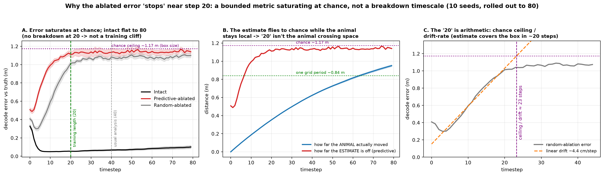
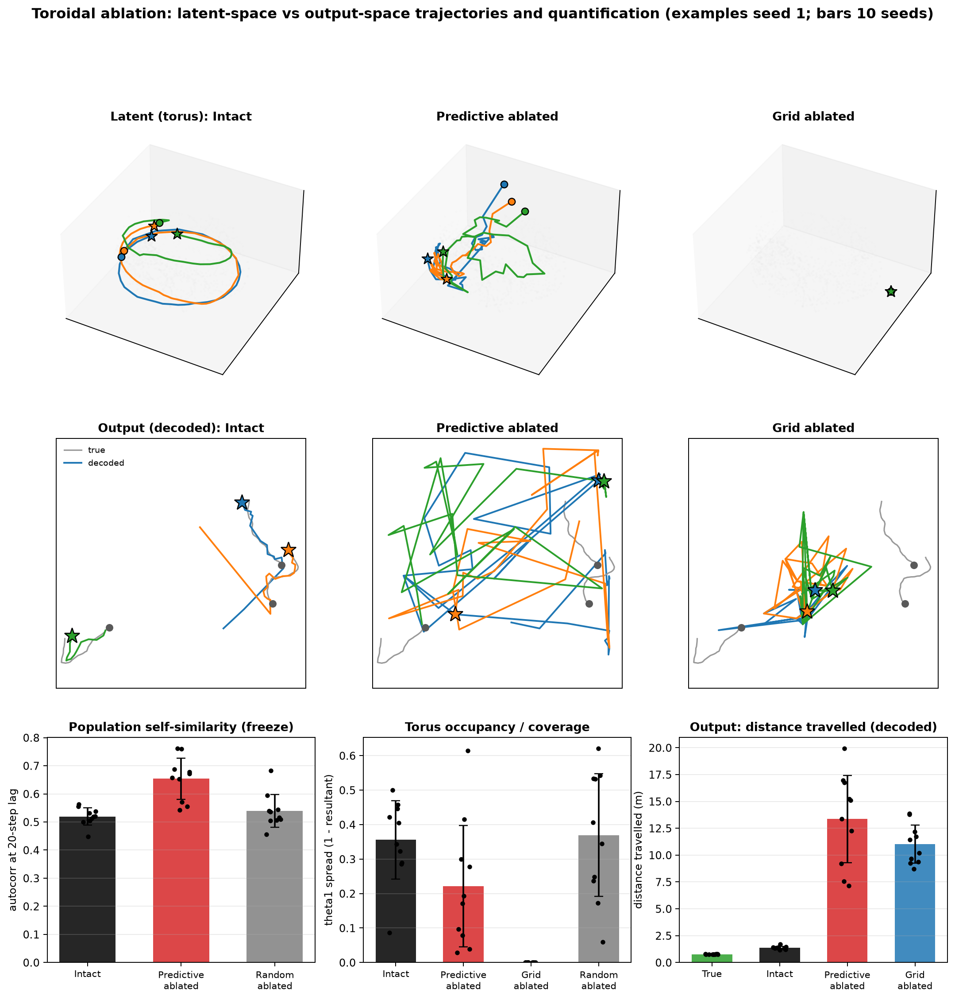

# What do predictive grid cells do? An ablation study — overview

A trained path-integrating RNN (4096 hidden "grid" units, 512 place-cell outputs, 2.2 m box) learns
to track its position by integrating velocity. Some of its grid units are **predictive grid cells
(PGCs)** — grid cells whose firing field is shifted *forward* along the direction of motion, i.e.
they represent where the animal is *about to be*. This document asks, across 10 trained networks,
**what PGCs actually do**, by deleting ("ablating") them and watching what breaks.

**Ablation** = zero a unit's input, recurrent, and output weights so its activity is exactly 0.
Every experiment compares: **Intact**, **Predictive-ablated** (all PGCs), and count-matched controls
(**Random** = same number of random units; **Structural** = same number of non-predictive grid cells;
**Grid** = all grid cells). Statistics are paired Wilcoxon across the 10 seeds.

---

## TL;DR
Removing PGCs **freezes the grid representation** (they are the motion-carrying cells) — the activity
stops traversing its torus and clumps. Yet the network's **decoded position wanders wildly**. These
reconcile: about **half** the wander is the decoder confusing repeated grid fields ("same place, wrong
tile"), and about half is a genuine collapse of the position code. The freeze is a **dynamical**
effect (PGCs carry no unusual weight), it is **robust** (it survives even when the network walks in
straight lines, p=0.004), and it is **intrinsic to networks that develop grids** — networks *trained*
on straight paths never develop grid cells (or PGCs) in the first place.

---

## 1. Does removing PGCs make the network "predict one spot"? → No — it wanders the most
We decode the network's believed position each timestep and measure how far it roams.

- Intact tracks the truth (0.23 m spread ≈ true 0.20 m). **Predictive-ablated wanders the *most*** —
  0.70 m spread, larger even than removing *all* grid cells (0.38 m), despite removing far fewer units.
  Predictive > grid **10/10 seeds, p=0.002**.
- So the meeting's "clumps to one spot" intuition is **refuted in the output**: PGC removal makes the
  position estimate roam, not freeze.
- *(Videos: `aarav_activity_space_ablation/output_true_vs_decoded_seed{0,3,4}.mp4` — true path in gray,
  decoded path in colour, growing over time.)*

## 2. Where does the wandering live? → Off the torus, and the position code collapses
We split the decoded output into a "torus" part and an off-torus residual, and we retrain a fresh
decoder on the ablated activity.

- The **torus angles are frozen** while the **output wanders** — so the wander is in the *off-torus*
  residual, not the torus coordinate.
- A **freshly retrained** decoder recovers intact position at ~10 cm (R²=0.73) but predictive-ablated
  at only ~90 cm (R²≈0.03, chance). So it is **not** the decoder "looking in the wrong place" — the
  spatial information genuinely **collapses**.
- PGCs carry **no unusual weight** (decoder/recurrent norms ≈ ordinary grid cells), so the effect is
  **dynamical**, not "high-leverage units."

## 3. Is the wandering "same place, wrong tile"? → About half of it (grid-field aliasing)
Grid cells are periodic — one grid *phase* corresponds to a whole **lattice of physical spots** (like
a tiled floor where every tile looks identical). If the network knows its phase but not which tile,
the decoder smears its position across the repeated grid fields. We test this by **folding** every
decoded position into a single tile: if the wander is tile-confusion, folding collapses it.

- **~52% of the predictive-ablated wander disappears when folded into one tile** — those "different"
  locations really are grid-field replicas of one phase (predictive > intact **10/10, p=0.002**;
  vs random p=0.014). Intact shows ~0 aliasing (it never leaves one tile) — the control that the
  metric isn't rigged.
- The other **~48%** is genuine within-tile phase error (folding doesn't remove it, and the retrained
  decoder can't recover it). So: **the network is confident about its grid phase but ambiguous about
  which tile.**

## 4. Does the grid population activity freeze? → Yes — the most static of all conditions
We measure how fast the grid population vector changes over time (cosine autocorrelation), on each
condition's surviving units (so zeroed units can't fake "frozen").

- Predictive-ablated is the **most self-similar over time** — at a 20-step lag, **more static than
  intact** (0.65 vs 0.52). Random ablation keeps changing (like intact). Predictive > random **10/10
  at lag 10 (p=0.002), 9/10 at lag 20 (p=0.004)**.
- Why: PGCs are the forward-shifted, **motion-encoding** cells; remove them and the surviving
  stable-phase cells can't push the representation forward → it freezes (jitters in place but doesn't
  progress).

## 5. Why does the effect look like it "happens at step 20"? → It doesn't — it's a metric ceiling
The decode error tops out around step 20, which *looks* like a breakdown timescale. Rolled out to 80
steps:

- The error saturates at the **chance ceiling** (~1.14 m = box size), and **intact stays flat to step
  80** — so 20 is *not* a training cliff. The animal only moves 0.35 m by step 20, so it is *not*
  box-crossing either. The "20" is just chance-ceiling ÷ drift-rate — an artifact of a bounded metric.

## 6. The two headline validations in one figure

Left: the **freeze** (population autocorrelation) — predictive stays high, random/intact decay.
Right: the **aliasing** (fraction of wander that is grid-field replicas, and the physical-vs-folded
spread). Both single out predictive ablation vs the count-matched random control.

## 7. Latent vs output: the reconciliation
Same networks, one figure: activity trajectories on the torus (top) and decoded trajectories in the
arena (bottom), with the quantification below.

- **Latent (torus):** intact loops the torus; predictive collapses into a compact tangle (frozen +
  clumped, occupancy 0.22 vs 0.36/0.37); grid ablation kills the torus entirely.
- **Output (decoded):** the same agents' decoded paths — intact tracks, predictive and grid wander.
- The story in one line: **frozen/clumped in latent space → wanders in output space.**

## 8. Does the freeze depend on random-walk trajectories? → No (straight *evaluation*)
We changed **only the evaluation trajectory** (random-walk → straight lines) on the *same* networks —
RNG-matched, so only the turning is removed (wall-free straight paths are 0.00° straight).

- The freeze **persists and strengthens**: predictive-ablated autocorrelation@20 rises 0.65 → 0.73–0.74,
  and predictive > random holds **9/10, p=0.004** on random-walk, straight, and boundary-free straight.
  So the freeze is a property of the recurrent dynamics, not of the random-walk input.
- **Honest nuance:** the predictive-vs-*structural* specificity flips on straight paths (structural
  freezes even more) — only the predictive-vs-random claim is trajectory-independent.

## 9. Do straight-*trained* networks even have grid cells? → No (they use band cells)
The deeper follow-up: run it on networks *trained* on straight trajectories. First a gate check —
do they develop grids at all? (Rate maps sampled with matched straight trajectories; gridness = a
hexagonality score of each cell's spatial autocorrelogram.)

- Straight-trained nets **barely develop grids**: mean gridness 0.016 vs 0.228 for a random-walk net;
  ~20 strongly-gridded units vs ~1100; their top cells are **stripe/border/noisy cells, not hexagons**.
- But they **did learn the task** (decoding error ~7 cm ≈ random-walk's 6 cm) — so it's a genuine
  *alternative* (band-cell) solution, not a broken network.
- Therefore the PGC-freeze experiment is **ill-posed** for them — no grids → no predictive grid cells
  → nothing to ablate. This is the deepest confound-avoidance: you can't decouple PGC ablation from
  random-walk training, because grids (hence PGCs) only form under 2-D exploratory training.
- Only 2 straight-trained seeds exist. (The Drive's other "straight" analysis is straight *evaluation*
  of the random-walk-trained net — which keeps its grids — a different thing.)

---

## Synthesis
Predictive grid cells act like the **motion / forward-update** part of the grid integrator. Remove
them and:
- the grid representation **freezes and clumps** (§4, §7) — a dynamical, not a weight, effect (§2);
- the decoded position **wanders** (§1), of which **~half is grid-field aliasing** ("same phase, wrong
  tile", §3) and ~half is a genuine **collapse** of the position code (§2);
- the effect is **robust** to walking in straight lines (§8);
- and it is **intrinsic to grid-developing networks** — straight-*trained* nets never form grids/PGCs
  (§9).

## Honest caveats (collected)
- The freeze and aliasing **magnitudes are not unique to PGCs** — random ablation is comparable;
  predictive is the extreme, and predictive cells are specifically the motion-encoding population.
- The "clean" freeze significance is **p=0.010** once measured on identical surviving units (the raw
  p=0.004 compares slightly different unit sets).
- The off-manifold metric was **dropped** — it wasn't predictive-specific.
- The straight-trained grid check used **zero-shift** gridness; a best-shift confirmation was
  computationally prohibitive but the conclusion holds from rate-map morphology.

## Reproducibility
Per-experiment READMEs, per-seed JSON/npz stats, and scripts are alongside each figure
(`aarav_*_summary.md`, `code/aarav_*.py`). Model checkpoints are **not** in the repo (`Models/` is
gitignored). Everything else is under `analysis_outputs/Single agent path integration/summary/`.
