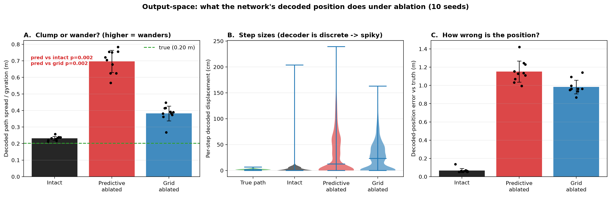

# Output-space validation: does latent clumping mean the network predicts "one spot"?

Speaker-2 action item: plot **true vs decoded position** for Intact / Grid-ablated /
Predictive-ablated, quantify **decoded step sizes**, and make side-by-side videos — to check
whether the latent-space (torus) clumping after predictive-grid-cell (PGC) ablation corresponds
to the network's path-integration *output* getting stuck in one place. Count was not matched for
the two headline conditions (natural full sets: all predictive vs all grid); count-matched
references (Random(N), Structural(N)) are in the stats. 10 seeds; seq-len 40.

**Hypothesis tested (from the discussion):** intact decoded path ~ true; *predictive-ablated*
decoded path **clumps** (tiny steps, stuck in one spot); *grid-ablated* decoded path **wanders**
(large erratic steps).

**Result: the hypothesis is _not_ supported.** Both ablations make the decoded position wander,
and **predictive ablation wanders the *most*** — it does not clump.

## Method
- Run the trained RNN on test random walks; decode the network's believed position each timestep
  with its own readout (decoder → top-3 place-cell centres — the network's trained position
  estimate; a continuous softmax-COM readout collapses to the centre for *all* conditions incl.
  intact, so it is not a valid position decode here).
- Conditions: Intact, Predictive-ablated (all predictive units), Grid-ablated (all grid units).
- Metrics per condition: **decoded path spread** (radius of gyration of the decoded positions —
  low = clumped, ≈true = tracks, high = wanders; robust to the decoder's discreteness),
  per-step decoded displacement, and decoded-position error vs truth.

## Results (10 seeds, mean ± std)
| | decoded spread (m) | decode error vs truth (m) |
|---|---|---|
| True path | 0.20 | — |
| **Intact** | 0.23 ± 0.01 (tracks) | 0.05 |
| **Predictive-ablated** | **0.70 ± 0.07 (wanders most)** | **1.15** |
| **Grid-ablated** | 0.38 ± 0.04 (wanders) | 1.00 |

- Predictive vs Intact spread: **10/10 seeds, p = 0.002.** Predictive vs Grid spread: **10/10,
  p = 0.002** (predictive wanders *more* than grid).
- Per-step displacement (panel B): intact tracks with small steps; both ablations show a heavy
  tail of large erratic jumps, predictive the most extreme.
- The decoded path under predictive ablation zig-zags across the whole arena (see videos), it
  does **not** sit in one spot.

## So, does latent clumping → "predicting one spot"? **No.**
The latent θ1 "clumping" (occupancy of one torus angle concentrating after PGC ablation) does
**not** translate into the network's *output* getting stuck. In output space the decoded position
**wanders the most** after predictive ablation. The torus θ1 projection and the full-population
position readout are different views: projecting degraded activity onto one torus coordinate can
concentrate even while the decoder (reading the whole, degraded population) produces erratic,
wandering position estimates. So the "clumping" should **not** be interpreted as the network
believing it is stuck in one place.

This is consistent with the earlier causal results: freezing predictive units made the decoded
position **overshoot** (advance ratio 1.94, not stall), and predictive ablation gave the highest
decode error — i.e. predictive units carry position information whose removal sends the estimate
to the *wrong, wandering* place, not to a fixed point.

## Videos (side-by-side true vs decoded over time, 3 clearest seeds: 0, 3, 4)
`output_true_vs_decoded_seed{0,3,4}.mp4` — gray = true path, colour = network-decoded path,
growing over timesteps, for Intact / Predictive-ablated / Grid-ablated. Intact hugs the truth;
predictive-ablated zig-zags across the arena; grid-ablated jumps erratically. These can be paired
with the latent-space torus videos (`torus_traversal_video*_seed{0,1}.mp4`) to contrast the
*latent* picture with the *output* picture.

## Caveats
- The two headline conditions are not count-matched (all predictive = ~670 vs all grid = ~2063);
  count-matched Random(N)/Structural(N) are in the per-seed JSON and also wander, so wandering is
  not specific to predictive cells per se — but predictive ablation is the most extreme.
- The decoder is discrete (top-3 place-cell centres), so per-step sizes are spiky; the spread /
  gyration metric is the robust summary.

*Scripts:* `code/aarav_output_space.py` (compute), `code/aarav_output_figure.py` (figure),
`code/aarav_output_video.py` (videos).
