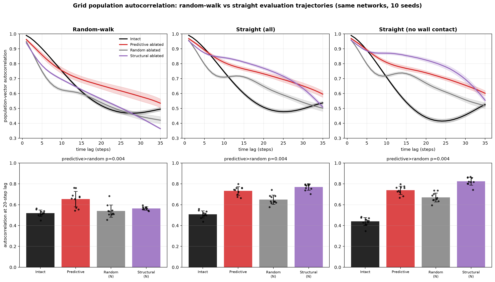

# Straight-path autocorrelation: does the PGC "freeze" depend on random-walk trajectories?

Controlled comparison. We took the **exact** grid-population-autocorrelation analysis used for random
walks and changed **only the evaluation trajectories** (random-walk → straight). Everything else is
identical: same trained networks (not retrained), same spatial-shift-defined predictive cells, same
10 seeds, same conditions, same count-matched random-ablation sampling, same lags, same statistics
(`cos_sim` / `temporal_metrics` are *imported* from the random-walk script, not re-implemented).

Question: the "freeze" (predictive ablation → grid population activity stops changing over time) was
found on random-walk trajectories. Is it an artifact of the unpredictable random walk, or does it
persist under simple straight motion?

## Method
- **Straight trajectories:** `trajectory_generator.py` style `"straight"` — heading held fixed
  (except wall avoidance), same Rayleigh speed process and same RNG draws as the random walk, so the
  same seed gives identical start positions / headings / speeds and the *only* difference is the
  removed turning. Verified: boundary-free straight paths have **0.00°** heading deviation (perfectly
  straight); random-walk paths deviate ~50°.
- **Measure:** grid population-vector autocorrelation `cos(g_t, g_{t+τ})` vs lag τ, on each
  condition's **surviving** grid units (zeroed units excluded, so ablation can't trivially inflate
  it). Key statistic: autocorrelation at a 20-step lag. Paired Wilcoxon across 10 seeds.
- **Conditions (unchanged):** Intact, Predictive-ablated (all PGCs), Grid-ablated, Random-ablated
  (N, count-matched, same sampling rule), Structural-ablated (N).
- **Secondary run (boundary filter):** straight paths hit the wall and turn (~47% of trajectories),
  so we recomputed everything on the subset that never contacts the border during the analysis
  window — from the same forward passes. This gives perfectly straight paths.

## Result: the freeze persists on straight paths — and strengthens

Autocorrelation at 20-step lag (mean over 10 seeds; higher = more static/frozen):

| dataset | Intact | Predictive | Random (N) | Structural (N) |
|---|---|---|---|---|
| Random-walk | 0.52 | **0.65** | 0.54 | 0.56 |
| Straight (all) | 0.51 | **0.73** | 0.65 | 0.77 |
| Straight (no wall contact) | 0.44 | **0.74** | 0.67 | 0.83 |

- **The headline replicates:** predictive ablation makes the grid population the most static vs the
  count-matched **random** ablation — **9/10 seeds, p = 0.004** on random-walk **and** on straight-all
  **and** on boundary-free straight. Predictive is also more static than intact (10/10) in all three.
- **It strengthens on straight paths:** predictive autocorrelation@20 rises from 0.65 (random-walk)
  to 0.73–0.74 (straight). So the freeze is **not** an artifact of the unpredictable random walk — it
  is, if anything, clearer under simple straight motion.
- Random ablation stays the least static (it removes mostly non-grid units, so it leaves the grid
  dynamics more intact), exactly as on random walks.

## Honest nuance: predictive-*specificity* is trajectory-dependent
On random walks predictive ablation froze *more than structural* grid ablation (pred > struct 8/10,
p=0.010) — the effect looked predictive-specific. **On straight paths this flips:** structural
ablation freezes even *more* than predictive (struct 0.77–0.83 vs pred 0.73–0.74; struct > pred,
p=0.006 boundary-free). Interpretation: on a straight path the "predict-the-next-state" demand is
trivial, so the functional gap between predictive and structural grid cells collapses — both
grid-cell subsets leave a frozen residual. What remains robust and trajectory-independent is the
count-matched **predictive-vs-random** comparison (p=0.004 everywhere), i.e. removing grid cells
freezes the grid population while removing random units does not.

## Bottom line
Changing only the evaluation trajectory type (random-walk → straight) does **not** abolish the PGC
freeze — it replicates at the same significance (p=0.004) and gets stronger. The freeze is a property
of the network's recurrent dynamics under grid-cell ablation, not of the random-walk input
statistics. Caveat: the *predictive-vs-structural* specificity seen on random walks does not survive
on straight paths.

*Scripts:* `code/aarav_population_activity_change_straight.py` (compute; imports the exact stats from
`aarav_population_activity_change.py`), `code/aarav_population_change_straight_figure.py` (figures).
Data: `Seed {0..9}/spatial_shift_allunits/aarav_population_change_straight/`.
