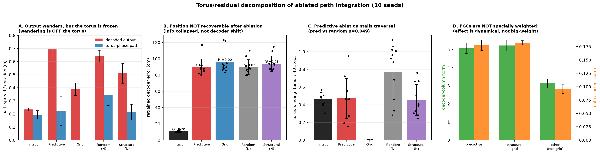
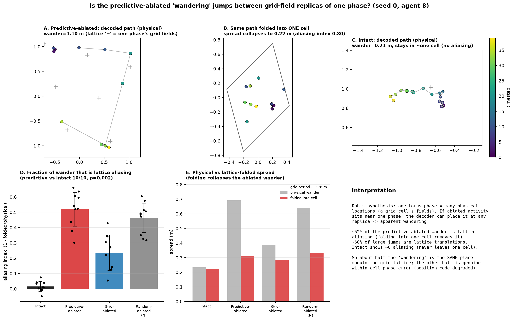
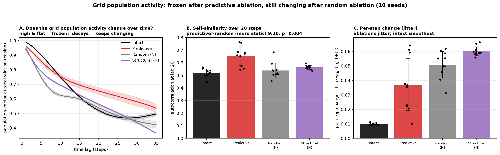

# Where does the predictive-ablated "wandering" come from? Torus vs residual, and grid aliasing

Follow-up to the output-space result (PGC ablation makes the decoded position *wander*, not clump).
Two questions, 10 seeds, all 4096 units, seq-len 40:
1. **Is the wandering ON the torus or OFF it?** Decompose the decoded output into a torus part and
   an off-manifold residual; retrain a decoder on ablated activity; measure traversal, weights,
   drift vs diffusion.
2. **Are the "different" wander locations actually the same place modulo the grid lattice?**
   (Rob's hypothesis: one torus phase = many physical locations = a grid cell's fields.)

## Plain-language summary
A grid module is like a **clock with no date**: it tells you where you are within one repeating
tile of space, but every tile looks identical, so one "phase" matches many physical spots (one per
tile). The network normally combines several such clocks to know which tile it is actually in.

Removing the predictive grid cells does three things:
1. **The clock freezes** — on the torus the activity stops moving and sits near one phase (this is
   the "clumping" seen in the meeting).
2. **The readout still wanders**, for two reasons, about half each:
   - **"Same spot, wrong tile" (grid aliasing).** One frozen phase matches one spot in *every*
     tile, so the decoder paints the position onto those repeated grid-field locations. Fold the
     scattered points back into a single tile and they collapse — they were the same place.
   - **Genuinely lost.** A freshly trained decoder cannot recover the true position from the
     leftover activity, so the position signal has really degraded, not just been relabeled.
3. **It is the dynamics, not "special cells."** Predictive cells have ordinary weights; removing
   them breaks the *motion* of the clock (their specific job), but the overall damage is about as
   bad if you remove the same number of random cells.

## Methodology
- **Models / data.** 10 trained path-integrating RNNs (Ng=4096 hidden, Np=512 place-cell outputs,
  2.2 m box, seq-len 40). Cells classified from the spatial-shift gridness data: *predictive* =
  gridness peak at positive shift ≥5 cm, *grid_all* = all grid cells, *structural* = grid minus
  predictive. Test set = 128 fresh random-walk trajectories per seed. All analyses use all 4096
  units; ablation = zeroing a unit's encoder/decoder/recurrent weights so its activity is exactly 0.
- **Decoding.** The network's believed position is `D(g) = top-3 place-cell centres of decoder(g)`
  (its own trained readout). "Spread / gyration" = sqrt(mean squared distance of a path to its own
  mean) — low = stays put, ≈true = tracks, high = wanders.
- **Torus basis.** FFT of the grid population's average rate map gives the reciprocal lattice
  (k1, k2); the coherent module is detected (UMAP+DBSCAN) and per-unit phases fit. Activity is
  projected to torus angles (θ1, θ2). The **torus-phase path** integrates dθ through the lattice
  (`Δp = K⁻¹·Δθ`, anchored at the true start) — a periodicity-free "position the torus angles imply."
  *(We deliberately do not decode the binned reconstruction `D(m(θ))`: a single module is periodic,
  so it cannot specify absolute position and looks dispersed even for intact activity.)*
- **Retrained decoder (collapse vs distribution-shift).** Ridge regression fit from ablated activity
  to (i) position and (ii) the true place-cell code, 3-fold cross-validated, then decoded with the
  same top-3 rule. If a fresh decoder recovers position → the original was just looking in the wrong
  place (distribution shift); if it cannot → spatial information has genuinely collapsed.
- **Traversal / drift / weights.** Traversal = torus winding number (net turns of θ1 over 40 steps).
  Drift = mean decoded-velocity error (systematic bias); diffusion = growth of cross-trial error
  variance. Weight load = L2 norm of each unit's decoder column and outgoing recurrent column, by
  class.
- **Grid aliasing test.** Fold each decoded position into one lattice unit cell:
  `u = K·p` (lattice coords) → `frac = u − round(u)` (within-cell phase) → `p_within = K⁻¹·frac`.
  Done **per trajectory** (circular mean phase per trajectory) so trajectories sitting at different
  phases are not conflated. `aliasing index = 1 − within-cell spread / physical spread`
  (→1 means the wander is entirely jumps between grid-field replicas of one phase). Also: fraction of
  large decoded jumps (>30 cm) whose lattice-coordinate change is an integer (a pure tile-to-tile
  translation). Lattice = the single dominant module (strongest FFT peak).
- **Stats.** Paired Wilcoxon across the 10 seeds.

## 1. The wandering is OFF the torus; the position code collapses

- **Output wanders, torus is frozen.** The decoded-output spread (gyration) is large for predictive
  ablation (~0.7 m) but the *torus-phase path* (position integrated from the module's θ1,θ2 through
  the lattice — periodicity-free) is concentrated (~0.1–0.3 m, *below* intact). So the wandering is
  **not** in the torus angles — it lives in the off-torus residual. This reconciles the apparent
  contradiction with the latent θ1 "clumping": on the torus the activity *does* clump/stall; in the
  output it wanders, because the wandering is the off-manifold part the decoder reads.
  *(Note: the literal `D(m(θ))` reconstruction is not used for this — a single torus module is
  periodic and cannot specify absolute position, so `D(m(θ))` is dispersed even for intact. The
  phase-integrated path is the correct periodicity-free torus position.)*

- **The position code genuinely collapses — it is NOT decoder distribution shift.** A *freshly
  trained, cross-validated* decoder recovers position from **intact** activity at ~10 cm (R²≈0.73)
  but from **predictive-ablated** activity only at ~85–90 cm (R²≈0.03) — essentially chance. So the
  original decoder isn't just "looking in the wrong place"; there is no recoverable position signal
  left. **This collapse is generic to ablation** (grid, random-N, structural-N all collapse to
  ~90 cm / R²≈0) — removing ~600 units and integrating through the broken recurrent loop for 40
  steps decorrelates activity from current position history-dependently.

- **Predictive-specific effect: stalled traversal.** Among equal-sized lesions, removing predictive
  cells specifically *reduces* torus traversal (winding number) relative to random-N (p=0.049) — the
  genuine PGC traversal role, consistent with the θ1-clumping result.

- **PGCs are not specially weighted.** Decoder-column norm and outgoing-recurrent-norm of predictive
  cells ≈ structural grid cells (10-seed means: decoder-column norm 5.07 vs 5.22, outgoing-recurrent
  norm 0.177 vs 0.182 — predictive if anything slightly lower). So the predictive-specific traversal
  effect is **dynamical / connectivity-pattern**, not "PGCs are high-leverage units."

- **Drift + diffusion.** Predictive ablation shows both a systematic decoded-velocity bias
  (~1–2 cm/step) and growing cross-trial variance (diffusion).

## 2. ~Half of the wandering IS grid-lattice aliasing (Rob's hypothesis, confirmed in part)

Fold each decoded position into one grid-lattice unit cell:
`u = K·p` (lattice coords), `frac = u − round(u)` (within-cell phase), `p_within = A·frac`.
If the wander is jumps between a single phase's grid-field replicas, folding collapses it.

| condition | physical wander (within a trajectory) | folded into one cell | **aliasing index** |
|---|---|---|---|
| Intact | 0.23 m (<⅓ grid period) | 0.22 m | **0.02** (none) |
| **Predictive-ablated** | **0.69 m (~1 grid period)** | **0.31 m** | **0.52** |
| Grid-ablated | 0.39 m | 0.28 m | 0.24 |
| Random-ablated (N) | 0.64 m | 0.33 m | 0.46 |

- **~52% of the predictive-ablated wander disappears when folded into one lattice cell** — those
  "different" locations really are **grid-field replicas of related phases** (the same place mod the
  grid lattice). Predictive > intact aliasing in **10/10 seeds, p=0.002**; predictive > grid 10/10,
  p=0.002. Intact shows ~0 aliasing (it never leaves one cell, so it can't alias).
- **~60% of the large decoded jumps are lattice translations** (fold to ≈0).
- It is **not unique to predictive**: random-N ablation aliases almost as much (0.46) — aliasing is a
  property of "the decoded estimate wandering across ≳1 grid period," which predictive and random
  both do (grid-ablation wanders less, so aliases less).
- It is **not the whole story**: the within-cell spread is still ~0.31 m (~0.4 of a period) and the
  retrained decoder can't recover position — so the other ~half is **genuine within-cell phase
  error**, consistent with the collapse in §1.

## 3. Validation on raw grid population activity: frozen after predictive ablation

A check that needs no torus projection and no decoder (Rob): just measure how much the grid-cell
**population activity vector changes over time** under each ablation. Prediction: predictive ablation
→ activity relatively *unchanging* (traversal stalls); random ablation of the same count → activity
keeps *changing* (dynamics preserved, like intact).

**Method.** Run the (ablated) network; take grid-unit activity g[t]. Measure temporal change ONLY on
that condition's **surviving** grid units (zeroed units are trivially constant — that would fake
"frozen") using **cosine** similarity (scale-free, so overall gain changes don't count):
population-vector autocorrelation `cos(g_t, g_{t+τ})` vs lag τ (high & flat = frozen; decays = keeps
changing), and per-step change `1 − cos(g_t, g_{t+1})`.

**Result (10 seeds, mean ± std).**

| condition | autocorr @10 | autocorr @20 | per-step change |
|---|---|---|---|
| Intact | 0.75 | 0.52 | 0.010 |
| **Predictive-ablated** | **0.75 (unchanging)** | **0.65 (most static)** | 0.037 |
| Random-ablated (N) | 0.62 (changing) | 0.54 | 0.051 |
| Structural-ablated (N) | 0.69 | 0.56 | 0.060 |

- The predictive-ablated population stays self-similar over time — at lag 20 it is **more static than
  intact** (0.65 vs 0.52): it does not traverse. Random-ablated decorrelates like intact (0.54), i.e.
  keeps changing. **Predictive > random in self-similarity: 10/10 seeds at lag 10 (p=0.002), 9/10 at
  lag 20 (p=0.004).** This confirms the prediction and validates the frozen-torus videos with raw
  activity.
- Per-step "jitter" actually *rises* under any ablation (intact is smoothest, 0.010); predictive
  jitters less than random but not significantly (7/10, p=0.13). So predictive ablation is
  **jitter-in-place that does not accumulate** (high long-lag autocorrelation), whereas random
  ablation's changes accumulate into genuine drift (low long-lag autocorrelation).
- **Why predictive specifically freezes it:** predictive cells are the forward-shifted, motion-
  encoding grid cells; removing them leaves the stable-phase (structural) cells, whose joint activity
  barely moves. Random ablation keeps the predictive/motion cells, so the population keeps evolving.

*(The population state's spread in a fixed intact-PCA basis collapses for ALL ablations — they all
leave the intact traversal subspace — so it does not separate predictive from random; the
autocorrelation does.)*

## Synthesis
The predictive-ablated decoded "wandering" is **(a) off the torus** — the torus angles are
frozen/clumped while the off-manifold residual drives the output — and the position code genuinely
**collapses** (not a decoder artifact). Of that wandering, **~half is grid-lattice aliasing** (jumps
between grid-field replicas of one phase, exactly Rob's mechanism) and ~half is genuine phase error.
The one **predictive-specific** signature is stalled torus traversal; the *magnitude* of the
wandering/collapse/aliasing is largely a generic consequence of lesioning the integrator, not unique
to PGCs (PGCs carry no unusual weight). Caveat: aliasing is measured against the single dominant grid
module (FFT peak of the grid population); the network has multiple modules whose combination
normally disambiguates absolute position.

*Scripts:* `code/aarav_torus_residual_decomposition.py`, `code/aarav_torus_residual_figure.py`,
`code/aarav_torus_aliasing.py`, `code/aarav_torus_aliasing_figure.py`,
`code/aarav_population_activity_change.py`, `code/aarav_population_change_figure.py`.
