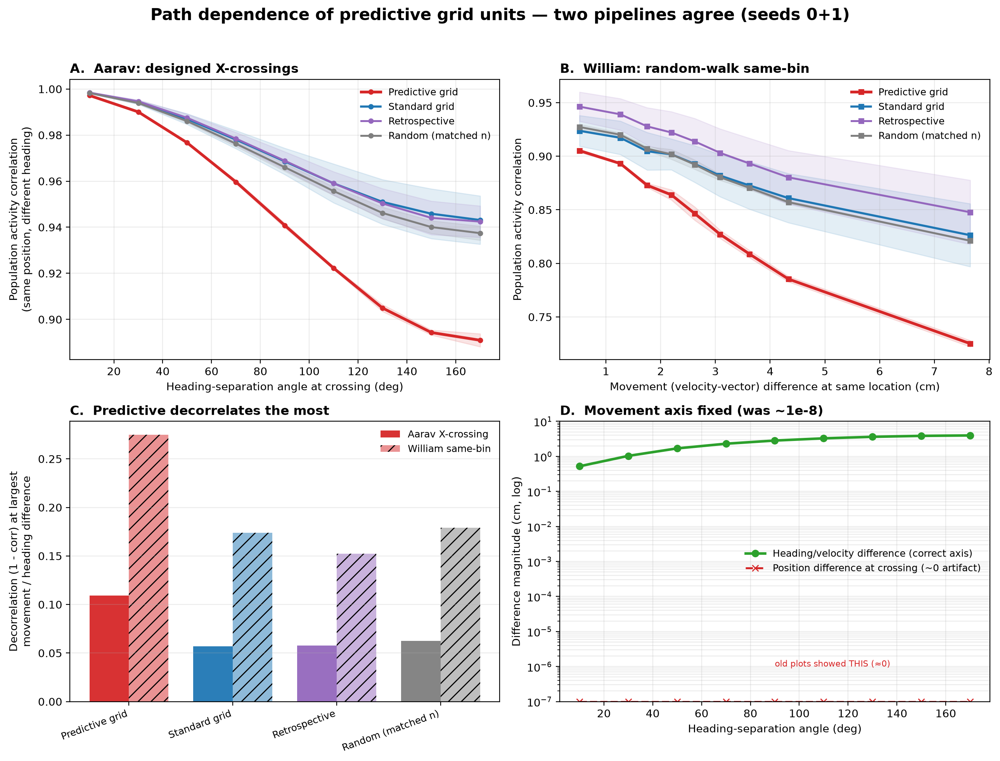

# Experiment 1 — Are predictive grid cells path/heading-dependent?

Crossing-trajectory / population-correlation analysis in a single-agent path-integrating RNN
(4096 units; predictive/grid classes taken from the all-units spatial-shift gridness data;
seeds 0–1).

**Question.** A *predictive grid cell* should care about **where the animal is going, not just where
it is**. Concretely: if the network is at the *same place* but *moving in a different direction*, the
activity of predictive units should change more than that of ordinary grid cells. We test this two
independent ways and show they agree.

---

## 1. The two pipelines

### (A) Aarav's designed **X-crossings** (controlled)
Instead of waiting for random trajectories to coincide, we *construct* them. For each of 4000 pairs:

- pick a shared crossing point near the centre of the box;
- give the two arms headings θ and θ + Δθ, with the heading separation **Δθ swept 10°→170°**;
- each arm is a straight line through the crossing point at **~2 cm/step** (matched to the training
  speed distribution), so the only thing that differs at the crossing is the **direction of travel**.

Run the RNN on both arms. **At the crossing timestep the two arms occupy the *exact same position*.**
There we take the population-activity vector of each arm, restrict it to a unit class, and compute the
**Pearson correlation** between the two arms. Average over pairs, binned by Δθ → a *path-dependence
curve*: same position, more different heading ⇒ how much does activity decorrelate?

Classes compared (all from the gridness data): **predictive** (grid cell whose gridness peaks at a
*positive* spatial shift ≥ 5 cm), **standard grid** (grid cell with ~zero shift), **retrospective**
(negative shift), and **random (count-matched)** — a random subset of all 4096 units the same size as
the predictive set (averaged over draws).

### (B) William's **same-bin** random walks (observational)
The classic version: run many random walks (40 batches × 200), bin position into a 44×44 grid (≈5 cm
bins). For any two visits that land in the **same bin**, compute (i) their **movement difference**
(the velocity-vector difference) and (ii) the population correlation for each class. Bin by movement
difference → the same kind of curve, but from naturally-occurring coincidences rather than designed
crossings (~23k pairs/seed).

**Correlation metric** (both pipelines): mean-centred Pearson correlation across the units of a class.

---

## 2. The bug fix (the "movement difference ≈ 10⁻⁸" artifact)

An earlier version plotted activity decorrelation against a "movement difference" that came out around
**10⁻⁸** — i.e. essentially zero. The cause: by construction the two arms are at the **same position**
at the crossing (`assert_crossing_batch` enforces `allclose(pos_A, pos_B, atol=1e-5)`), so a "movement
difference" computed as a **position** difference there is ~0 (float noise). The meaningful axis is the
**heading / velocity-vector difference**, which is *not* zero:

| heading sep Δθ | 10° | 50° | 90° | 130° | 170° |
|---|---|---|---|---|---|
| **velocity difference at crossing (m)** | 0.005 | 0.017 | 0.028 | 0.036 | 0.040 |
| position difference at crossing (m) | 0 | 0 | 0 | 0 | 0 |

(velocity difference = 2·step·sin(Δθ/2), with step ≈ 0.02 m.) **Panel D** of the figure plots both, so
the artifact is explicit and corrected. We also fixed the speed: the old code ran the arms at
~7.5 cm/step (≈4× the training speed, out of distribution); here they run at ~2 cm/step.

---

## 3. Results (figure panels A–D, seeds 0–1)

### Panel A — designed X-crossings: predictive units decorrelate the most
Population correlation between the two arms (same position, different heading) as Δθ grows:

| class | corr @10° | corr @90° | corr @170° |
|---|---|---|---|
| **Predictive** | 1.00 | 0.94 | **0.89** |
| Standard grid | 1.00 | 0.97 | 0.95 |
| Retrospective | 1.00 | 0.96 | 0.94 |
| Random (matched) | 1.00 | 0.96 | 0.94 |

Predictive units fall to **0.89** at 170° (decorrelation ≈ 0.11) — roughly **twice** the decorrelation
of standard grid cells (≈ 0.05). The other classes (standard, retrospective, random) cluster together;
**predictive is the clear outlier**. (Both seeds: predictive →0.89; standard grid →0.95/0.93.)

### Panel B — William's same-bin: same story, independent method
Correlation vs movement difference at the *same location*:

| class | corr @0.5 cm | corr @2.6 cm | corr @~8 cm |
|---|---|---|---|
| **Predictive** | 0.90 | 0.84 | **0.72** |
| Standard grid | 0.94 | 0.91 | 0.86 |
| Retrospective | 0.93 | 0.89 | 0.82 |
| Random (matched) | 0.92 | 0.89 | 0.82 |

Predictive again drops the most (0.90 → **0.72**), well below every other class. So *fixing position and
increasing how differently you're moving decorrelates predictive units most* — the original William
finding, reproduced.

### Panel C — decorrelation summary
Decorrelation (1 − corr) at the largest heading/movement difference, both pipelines: predictive is the
tallest bar in each, confirming it is the most path/heading-dependent class.

### Panel D — movement-axis QC
The corrected movement axis (heading/velocity difference, green) rises 0.5 → 4 cm; the old "position
difference at the crossing" (red) sits on the floor (~0). The earlier 10⁻⁸ plots were reading the red
line.

---

## 4. Conclusion

**Two independent pipelines — designed X-crossings and random-walk same-bin — agree that predictive
grid units are the most path/heading-dependent class.** When the network is at the same location but
moving differently, their population activity decorrelates roughly twice as much as standard grid
cells, and more than retrospective or count-matched random units. This is the core validation that the
"predictive" label is meaningful: these units encode *where the animal is going, not just where it is*.

This is the robust starting point that the downstream ablation/torus experiments then probe for a
*mechanism* (see `../aarav_PGC_torus_summary.md`): predictive units are path-dependent and carry
position information, but they are **not** what maintains the toroidal manifold.

## 5. Caveats / methods notes
- Run on **seeds 0–1** (the crossing pipeline; the downstream ablation work used all 10 seeds).
- The X-crossing arms are idealised straight lines at constant speed; the two arms also have different
  *start points* and full histories, so the decorrelation reflects the whole approach path with
  heading separation as the controlled variable — not an instantaneous-heading-only effect.
- "Predictive" is defined by a spatial-shift gridness threshold (peak gridness ≥ 0.2 at preferred shift
  ≥ 5 cm); the magnitude of decorrelation depends on that definition.
- Standard grid cells are the most *stable* class across heading (highest correlation); retrospective
  and random track each other, so the clean contrast is **predictive vs everything else**.

*Script:* `code/aarav_crossing_population_correlation.py` (analysis) and
`code/aarav_crossing_figure.py` (figure). *Data:* `crossing_population_corr.json` per seed.
