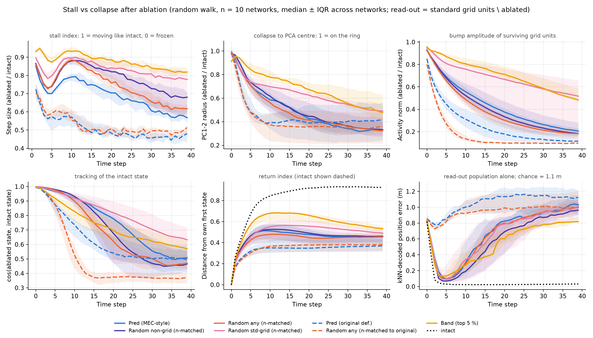
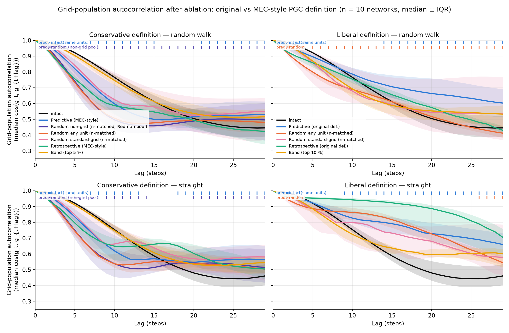
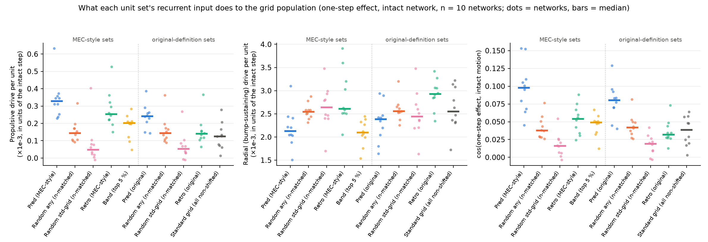

# Does the PGC-ablation phenotype depend on the PGC definition? (stall vs collapse, propulsion vs "repulsion")

**Context (Slack 2026-08-22).** With the MEC-style definition of a predictive grid unit now used in the draft
(a PGC must *not* be a standard grid unit at zero shift), Will sees "less of a stalling out and more of a
collapse back to the original state of the network" after ablation, reads PGCs as a "repulsion force", and
reports a "subtle" autocorrelation effect (lack of grid-population de-correlation at long lags). Our earlier
analysis (original definition: peak-shift only) found a strong "freeze" (autocorr@20 0.65 vs 0.52, 10/10 seeds).
This folder asks **what changed, and which claims survive proper controls** — using the existing all-4096-unit
classifications (no re-scoring), 10 legacy networks (`Seed 0-9`, wd 1e-4), full-unit lesions, 256 trajectories
x 40 steps per network, identical trajectories across conditions.

Scripts: `code/aarav_definition_dynamics.py` (per seed), `code/aarav_definition_dynamics_figure.py` (aggregate),
`code/aarav_definition_weights.py` (weight stats). Per-seed outputs: `Seed N/spatial_shift_allunits/aarav_definition_dynamics/`.

## Definitions derived from the cached score curves (`gridness_data.npz`, spatial shift, all 4096 units)

| set | rule | median n / network |
|---|---|---|
| standard grid (read-out population, = Redman's `grid_ids`) | zero-shift gridness ≥ 0.4 | 1107 (of 2918 non-dead) |
| **Pred (original def., ours)** | best gridness ≥ 0.2 at best shift ≥ +5 cm | 626 |
| **Pred (MEC-style / conservative)** | zero-shift gridness < 0.4 **and** best gridness ≥ 0.3 at best shift ≥ +5 cm | 239 |
| retrospective (both defs) | mirror image (≤ −5 cm) | 734 / 224 |
| band | top 5 % band score (paper's criterion); top 10 % as `band90` | 146 / 298 |
| controls (3 draws each) | count-matched random from all non-dead units; from non-grid units (Redman's pool); from standard-grid units that are not predictive/retrospective under either definition ("structural") | |

Thresholds were chosen so the MEC-style classes match the draft's proportions (standard grid ≈ 38 % of non-dead,
predictive ≈ 6 %). Facts that matter below: the MEC-style set is a strict subset of our original set (100 %);
**48 % of our original PGCs are standard grid units** (gs0 ≥ 0.4; ~75 % have gs0 ≥ 0.3), i.e. they are
forward-shifted *torus* units, whereas MEC-style PGCs are non-torus by construction.

## 1. What every ablation does: progressive collapse, not a stall, not a return to the start

Late window (steps 20–39), median across 10 networks, read-out = standard grid units minus the ablated set,
always compared with the intact network on the same units and trajectories:

| condition (n) | step size / intact | PC1-2 radius / intact | activity norm / intact | cos(ablated, intact state) | dist. from own start / intact | kNN-decoded error (m) | kNN dist. to start pos. (m; true 0.48) | off-manifold NN dist (intact 0.08) |
|---|---|---|---|---|---|---|---|---|
| Pred MEC-style (239) | 0.61 | 0.35 | 0.27 | 0.57 | 0.52 | 0.92 | 0.99 | 0.33 |
| random non-grid (239) | 0.73 | 0.37 | 0.24 | 0.49 | 0.51 | 0.85 | 0.94 | 0.35 |
| random any unit (239) | 0.66 | 0.36 | 0.22 | 0.50 | 0.52 | 0.92 | 0.95 | 0.35 |
| random standard-grid (239) | 0.81 | 0.55 | 0.59 | 0.71 | 0.64 | 0.91 | 0.92 | 0.21 |
| retro MEC-style (224) | 0.53 | 0.35 | 0.12 | 0.44 | 0.50 | 1.06 | 1.09 | 0.40 |
| band top-5 % (146) | 0.85 | 0.56 | 0.59 | 0.63 | 0.64 | 0.77 | 0.82 | 0.23 |
| Pred original (626) | 0.47 | 0.40 | 0.13 | 0.51 | 0.49 | 1.14 | 1.14 | 0.33 |
| random any unit (626) | 0.50 | 0.35 | 0.10 | 0.37 | 0.47 | 1.00 | 1.00 | 0.35 |
| random standard-grid (389) | 0.65 | 0.41 | 0.48 | 0.63 | 0.57 | 1.04 | 1.04 | 0.20 |

* **Collapse is generic.** After *any* ablation of a few hundred units the surviving grid units lose activity
  (norm → 0.1–0.3 of intact by step 40), leave the manifold (NN distance 3–4x intact), and their PC1-2 projection
  spirals into the centre (radius → 0.35). The population keeps moving (step ratio 0.5–0.8), mostly *along* the
  intact direction early on (velocity projection 0.5 at t = 10 for MEC-style PGC and random alike), so the
  phenomenon is amplitude decay, not a stall.
* **"Collapse back to the original state" is a PCA artefact of the initial transient.** Intact trajectories
  *start* near the PCA centre (encoder-initialised state: PC1-2 radius 0.11 vs 0.30 on the ring, seed 0) and
  move out onto the ring. The collapsed low-amplitude state also projects to the centre, so the ablated loop
  ends where it began (`example_pca_trajectories.png`). But it is not the start state: distance from the
  trajectory's own first state plateaus at ~0.5 of intact and barely decreases (0.52 → 0.46), and a kNN decoder
  on the read-out population puts the collapsed state ~1 m from the start position (chance; intact 0.48 m true).
* **Under the MEC-style definition nothing is PGC-specific.** Pred-MEC vs count-matched random (either pool) is
  n.s. on every collapse metric (PC radius p = 0.92/0.70, norm p = 0.92/0.38, tracking p = 0.77/0.23, return
  index p = 0.92/0.06, kNN error p = 0.56/0.70, NN distance p = 0.77/0.92). Removing the same number of
  *standard grid* units dents the remaining torus much less (norm 0.59 vs 0.27, p = 0.049; PC radius p = 0.01;
  NN distance p = 0.002) — the grid population is more sensitive to losing non-grid input units than to losing
  some of its own members, for MEC-style PGCs and random non-grid units alike. Decoding error: 0.68 m vs random 0.55–0.57 m (n.s., p = 0.1–0.23; Redman's recurrent-only lesion gives the
  same numbers, 0.677 vs 0.553–0.568).
* **Under the original definition the "freeze" replicates but is a grid-unit effect.** Pred-original ablation
  stays more self-similar than count-matched random (autocorr@20 +0.16, p = 0.002, 10/10; tracking +0.14,
  p = 0.002) — but 389 random *standard grid* units freeze the population just as much (autocorr@20 Δ = +0.01,
  p = 0.23) with a milder collapse. Removing torus units leaves the remaining torus units in a static,
  low-amplitude pattern; removing random (mostly non-torus) units leaves a collapsed state that keeps churning.

## 2. The autocorrelation panel, both definitions, random walk and straight paths

Δ autocorrelation (ablated − intact on the same units), median across networks, Wilcoxon p, networks with Δ > 0:

| condition | traj | lag 10 | lag 20 | lag 25 | lag 29 |
|---|---|---|---|---|---|
| Pred MEC-style | RW | −0.15 (p .004) | +0.02 (p .16, 7/10) | +0.08 (p .004, 9/10) | +0.09 (p .006, 9/10) |
| random non-grid (Redman pool) | RW | −0.27 (p .002) | −0.01 (n.s.) | +0.04 (p .08, 7/10) | +0.03 (p .08, 8/10) |
| random any unit | RW | −0.25 (p .002) | −0.01 (n.s.) | +0.04 (p .04, 7/10) | +0.04 (p .04, 7/10) |
| random standard-grid | RW | −0.09 (p .02) | +0.04 (n.s.) | +0.08 (p .03, 8/10) | +0.10 (p .03, 8/10) |
| band top-5 % | RW | −0.03 (n.s.) | +0.03 (p .05) | +0.05 (p .004) | +0.05 (p .004) |
| Pred MEC-style | straight | −0.10 (p .004) | +0.08 (p .002, 10/10) | +0.14 (p .002, 10/10) | +0.11 (p .002, 10/10) |
| random non-grid | straight | −0.24 (p .002) | +0.07 (p .002, 10/10) | +0.08 (p .002, 10/10) | +0.05 (p .01, 8/10) |
| random standard-grid | straight | −0.06 (p .02) | +0.09 (p .002, 10/10) | +0.12 (p .002, 10/10) | +0.13 (p .006, 9/10) |
| Pred original | RW | +0.00 (n.s.) | +0.14 (p .01, 8/10) | +0.13 (p .01) | +0.10 (p .01) |
| random any unit (626) | RW | −0.10 (p .004) | +0.01 (n.s.) | −0.00 (n.s.) | −0.04 (n.s.) |
| random standard-grid (389) | RW | −0.03 (n.s.) | +0.09 (p .01, 8/10) | +0.14 (p .006, 9/10) | +0.15 (p .03, 7/10) |

* The draft's observation reproduces: MEC-style PGC ablation de-correlates *faster* than intact at lags ≤ 15 and
  stays *higher* at lags ≥ 25 (+0.08–0.09, p < 0.01). On straight paths the long-lag elevation is larger and
  10/10 (as Will expects).
* But the long-lag elevation is the signature of the collapsed state and **every ablation shows it** (random
  any-unit, random standard-grid, band; on straight paths all at p ≤ 0.01, 10/10). Relative to count-matched
  random controls the MEC-style PGC elevation is larger by only +0.02–0.05 (vs non-grid pool p = 0.004–0.01;
  vs any-unit pool p = 0.06–0.16 RW, 0.01–0.13 straight) and equal to removing the same number of standard grid
  units (p ≈ 1).
* The significant pred-vs-random difference at **short** lags (lags 1–15, p ≤ 0.004; the star in Will's panel)
  means MEC-style PGC ablation perturbs the grid population *less* than removing random non-grid units — not that
  PGCs have a distinctive long-timescale role.
* Band (top 5 %) ablation is the *mildest* perturbation here (short-lag autocorr above Pred-MEC, p ≤ 0.01) — the
  opposite of Will's panel B-middle; his band ids should be compared directly. Retro-MEC ablation is slightly
  stronger than Pred-MEC (step ratio p = 0.049, norm p = 0.02, tracking p = 0.014), not identical.

## 3. "Repulsion force" vs propulsion: what the PGC input actually does to the grid population

Exact one-step effect of removing a unit set's recurrent input in the intact network, projected onto the
intact motion direction (propulsion) and the outward radial direction (bump sustaining / "repulsion from the
centre"), in units of the intact step (median across networks; all comparisons paired Wilcoxon):

| set (n) | propulsive component | radial component | propulsive / radial | cos(effect, motion) | propulsive per unit (x1e-3) |
|---|---|---|---|---|---|
| Pred MEC-style (239) | 0.081 | 0.51 | **0.157** | **0.098** | **0.33** |
| random any (239) | 0.035 | 0.62 | 0.058 | 0.038 | 0.14 |
| random standard-grid (239) | 0.011 | 0.65 | 0.021 | 0.016 | 0.05 |
| retro MEC-style (224) | 0.055 | 0.61 | 0.102 | 0.054 | 0.25 |
| band top-5 % (146) | 0.030 | 0.31 | 0.092 | 0.049 | 0.20 |
| Pred original (626) | 0.146 | 1.49 | 0.106 | 0.080 | 0.24 |
| – its standard-grid half (306) | 0.031 | 0.74 | 0.043 | 0.031 | 0.10 |
| – its non-grid half (402) | 0.059 | 0.92 | 0.070 | 0.047 | 0.18 |
| all standard grid, non-shifted (721) | 0.092 | 1.89 | 0.049 | 0.038 | 0.13 |
| velocity input (direct) | 0.019 | 0.07 | — | 0.027 | — |
| all recurrent input | 0.447 | 7.60 | 0.060 | 0.048 | — |

* Every set's input is dominated by the outward/radial ("repulsive") component — that is simply recurrent
  excitation sustaining the bump, and per unit MEC-style PGCs supply *less* of it than random or standard grid
  units (p = 0.049 / 0.08). Removing any set removes some of it, which is why any ablation collapses the state.
  So "repulsion" is real but generic, not a PGC property.
* What *is* PGC-specific, under both definitions, is the **direction** of their drive: 2.3x more propulsive
  than random units and 7x more than standard grid units (p = 0.002, 10/10 on every propulsion measure); the
  propulsion of our original set lives entirely in its non-grid (MEC-style) half (cos 0.098 vs 0.031, p = 0.002;
  the grid-like half is indistinguishable from standard grid cells, p = 0.16).
* Consistent with a shifter/conjunctive role: MEC-style PGCs receive 2x the velocity-input weight of standard
  grid or random units (|W_ih| 0.33 vs 0.15–0.16, p = 0.002), have 30 % smaller decoder weights (p = 0.002), and
  project onto the grid population as strongly as anyone else (`class_weight_stats.json`). The velocity input's
  direct one-step effect on the grid population is tiny (0.02 of a step): the motion signal reaches the grid
  population through recurrent units, and PGCs are enriched among them.
* But they carry only ~18 % of the recurrent propulsive drive with 8 % of the units, so removing them does not
  stall the bump (step ratio 0.6–0.8 early on, same as random): the remaining units carry the motion while the
  lost excitation lets the amplitude decay.

## 4. Why the earlier result "went away": the synthesis

1. **The two definitions pick different cells.** Our original PGCs were mostly forward-shifted *torus* units
   (48 % standard grid at gs0 ≥ 0.4, ~75 % at ≥ 0.3). Ablating them removes a large chunk of the attractor
   itself → the remaining torus units settle into a static pattern ("freeze": autocorrelation far above
   count-matched random) — but removing a similar number of ordinary grid units freezes them just as much.
   MEC-style PGCs are non-torus by construction; ablating them is a generic perturbation indistinguishable
   from count-matched random non-grid units: amplitude decay without the freeze.
2. **"Stall" and "collapse" were the same phenomenon seen through different metrics.** The frozen torus angle
   and high autocorrelation we reported are what a decayed, off-manifold, slowly-moving state looks like; the
   PCA picture shows the same state as a loop that returns to the centre. Neither is a return to the start
   state or to the start position.
3. **The long-lag autocorrelation elevation is not a PGC signature.** It appears for random, structural and band
   ablations alike (all 10/10 on straight paths); PGC-vs-random differences are +0.02–0.05 and inconsistent.
4. **The defensible, definition-independent claim is mechanistic, not lesion-based:** PGCs (strictly, the
   non-grid/MEC-style ones) are the velocity-receiving units whose recurrent input pushes the grid population
   along the direction of travel — a shifter population in CAN terms — which is what the path-dependence and
   the intervention result (PGC-subspace drive moves the phase) already say. Lesion phenotypes follow from how
   much of the torus a definition happens to remove.

## Caveats
* Full-unit lesion here; for the grid population's dynamics it is identical to Redman's recurrent-only lesion
  (ablated units feed nothing back). Decoding error with his lesion is reported for reference (same numbers).
* In the 2026-08-10 clone of Will's `computing_grid_cell_activity_autocorrelation.py` the random control
  shuffles `non_dead_ids` but indexes `non_grid_ids[:N]`, so all 20 "random" draws are the same lowest-index
  non-grid units — worth checking before the panel is final.
* Classes come from spatial-shift scores (±20 cm); the draft uses temporal shifts. Thresholds were calibrated
  to the draft's class proportions, not copied from its shuffle test.
* 10 legacy networks (wd 1e-4); the 30-network canonical cohort has all-4096 classifications for only 2 seeds.
