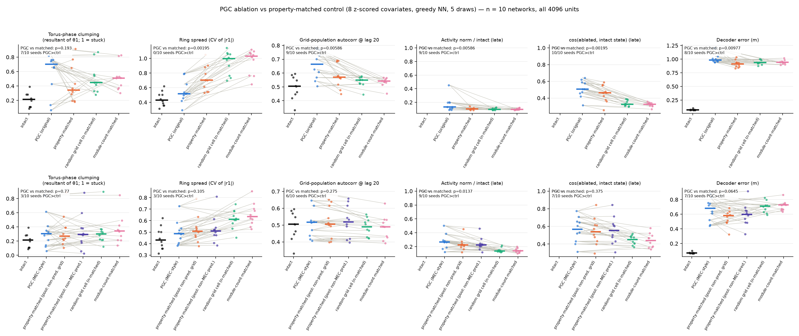

# Does the "striking torus effect" survive the property-matched control?

**Question.** Our torus analysis (`aarav_ablation_torus.py`) showed that removing predictive grid units makes
the grid population's torus trajectory collapse into a compact tangle — torus-phase clumping 0.55 vs 0.23 for
count-matched random units — the "PGCs move the signal across the torus" result. That comparison used random
units drawn from the *whole* network (mostly non-grid). Here the control is the property-matched one from the
decoding-error analysis (`pgc_matched_ablation.py`): each PGC is described by 8 covariates (module, gridness,
bandness, firing-rate variance, head-direction tuning, decoder-weight norm, incoming and outgoing recurrent
weight norm), z-scored over the pool, and paired — in a random order, 5 times — with the closest still-unused
non-predictive grid cell by Euclidean distance in that 8-D space. Covariates were assembled for all 4096 units
of the 10 legacy networks (`pgc_covariates.assemble_covariates`); classes are the cached all-4096 spatial-shift
classes (no re-classification); both PGC definitions are tested.

Scripts: `code/aarav_matched_torus.py` (per seed), `code/aarav_matched_torus_figure.py` (aggregate).
Per-seed outputs: `Seed N/spatial_shift_allunits/aarav_matched_torus/` (covariates, matched sets, torus coords, JSON).

## Matching quality

| | original def. (626 PGCs; pool = retro ∪ normal, ~1400) | MEC-style (239 PGCs; pool A = retro ∪ normal) |
|---|---|---|
| median NN distance in z-space, matched / random | 0.61 / 0.72 | 0.58 / 0.86 |
| standard-grid fraction, PGC / matched | 0.48 / 0.48 | 0.15 (matched) |
| toroidal-module units removed, PGC / matched / random | 150 / 162 / 152 | 81 / 83 / 55 |

Covariate profile (z over pool, median across networks): original PGCs are at module −0.14, gridness −0.15,
rate-var −0.19, hd_r +0.31, decoder −0.08, rec_in −0.15; the matched sets reproduce every entry within 0.04;
random sits at 0. MEC-style PGCs are more extreme (gridness −0.75, hd_r +0.65, decoder −0.50) and again the
matched sets reproduce the profile (gridness −0.70, hd_r +0.62, decoder −0.47). A second MEC-style pool
(B = grid union minus MEC-PGCs, i.e. forward-shifted grid units allowed) gives the same answers.

## Results (median across 10 networks; paired Wilcoxon, networks with PGC > control)

**Original definition**

| metric | intact | PGC | property-matched | random grid cell (n) | module-count-matched |
|---|---|---|---|---|---|
| torus-phase clumping (1 = stuck) | 0.21 | **0.70** | 0.34 (Δ+0.04, p = 0.19, 7/10) | 0.45 (p = 0.38, 7/10) | 0.51 (p = 0.49, 7/10) |
| ring spread (CV of r1) | 0.43 | 0.52 | 0.70 (p = 0.002, 0/10) | 1.00 (p = 0.002) | 1.03 (p = 0.002) |
| grid-pop. autocorr @ lag 20 | 0.51 | 0.66 | 0.57 (Δ+0.06, p = 0.006, 9/10) | 0.55 (p = 0.01) | 0.54 (p = 0.006) |
| activity norm / intact (late) | 1 | 0.13 | 0.10 (Δ+0.03, p = 0.006, 9/10) | 0.10 (p = 0.03) | 0.10 (p = 0.03) |
| cos(ablated, intact state) (late) | 1 | 0.51 | 0.46 (Δ+0.06, p = 0.002, 10/10) | 0.33 (p = 0.002) | 0.33 (p = 0.002) |
| step size / intact (late) | 1 | 0.47 | 0.47 (p = 0.63) | 0.50 (p = 0.01, 2/10) | 0.50 (p = 0.004) |
| PC1-2 radius / intact (late) | 1 | 0.40 | 0.41 (p = 0.85) | 0.31 (p = 0.23) | 0.36 (p = 0.38) |
| decoder error (m) | 0.07 | 0.98 | 0.91 (Δ+0.10, p = 0.01, 8/10) | 0.94 (p = 0.04) | 0.94 (p = 0.03) |

**MEC-style definition**

| metric | intact | PGC | property-matched (pool A) | property-matched (pool B) | random grid cell (n) | module-count-matched |
|---|---|---|---|---|---|---|
| torus-phase clumping | 0.21 | 0.31 | 0.27 (p = 0.77, 3/10) | 0.29 (p = 0.92) | 0.30 (p = 0.85) | 0.34 (p = 0.56) |
| ring spread | 0.43 | 0.49 | 0.51 (p = 0.11) | 0.51 (p = 0.05, 2/10) | 0.61 (p = 0.02, 1/10) | 0.63 (p = 0.006) |
| autocorr @ lag 20 | 0.51 | 0.52 | 0.51 (p = 0.28) | 0.52 (p = 0.77) | 0.49 (p = 0.06) | 0.49 (p = 0.01, 9/10) |
| activity norm / intact | 1 | 0.27 | 0.23 (Δ+0.05, p = 0.014, 9/10) | 0.23 (p = 0.02) | 0.14 (p = 0.01) | 0.14 (p = 0.01) |
| cos(ablated, intact) | 1 | 0.57 | 0.54 (p = 0.38) | 0.55 (p = 0.63) | 0.45 (p = 0.02) | 0.44 (p = 0.01) |
| decoder error (m) | 0.07 | 0.68 | 0.58 (Δ+0.09, p = 0.065, 7/10) | 0.60 (p = 0.11) | 0.71 (p = 0.56) | 0.73 (p = 0.38) |

Torus-phase clumping per network (original definition) — PGC: 0.76 0.66 0.93 0.65 0.14 0.74 0.76 0.07 0.43 0.82;
matched: 0.32 0.77 0.91 0.65 0.19 0.43 0.20 0.29 0.37 0.18. The effect is large in six networks, absent in two
(seeds 4 and 7, where PGC ablation does not clump at all), reversed in one, and seed 2's torus basis is
degenerate (intact already 0.91).

## Reading

* **The striking torus effect does not survive.** Against any grid-cell control — property-matched, random
  grid cells, or the same number of toroidal-module units — the phase clumping is not significant (p = 0.19–0.49)
  under the original definition and absent under the MEC-style one (0.31 vs 0.27–0.34, intact 0.21). The earlier
  0.55-vs-0.23 separation came from a random pool of mostly non-grid units, which barely touches the module.
  (The torus-decoded RMSE in this pipeline integrates phase *differences* from the true start, so a stuck phase
  scores as well as the intact network — it is not a collapse measure and is not reported.)
* **Nothing about the collapse is PGC-specific once properties are matched**: step size, PC-radius, tangential
  velocity and kNN-decoded error are identical for PGC and matched ablation under both definitions.
* **What does survive the matched control (original definition only, modest):** after PGC removal the
  surviving grid units keep a little more activity (norm 0.13 vs 0.10, p = 0.006), stay closer to the intact
  pattern (cos 0.51 vs 0.46, p = 0.002, 10/10) and are more self-similar over time (autocorr@20 +0.06, p = 0.006,
  9/10), while the decoder error is higher (+0.10 m, p = 0.01). Under the MEC-style definition only the
  milder amplitude decay (p = 0.014) and a marginal decoder-error excess (p = 0.065) remain. This is consistent
  with the drive decomposition (`../aarav_definition_dynamics/`): per unit PGCs contribute less bump-sustaining
  (radial) and more motion-aligned (tangential) drive than matched cells, so removing them degrades the bump
  slightly less but advances it no more — a small, property-independent "less decay, more static" signature,
  not a compact tangle.
* The decoding-error excess over the matched control is the lesion result that keeps replicating
  (here +0.10 m at full ablation; 3.1x slope on the 30-seed cohort).
