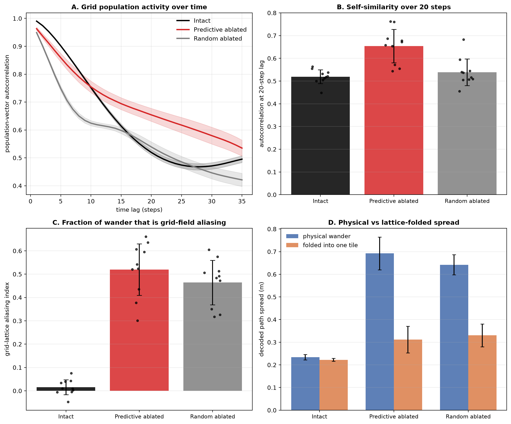

# Validating the predictive-grid-cell ablation effect: frozen population activity + grid aliasing

Two validations of the toroidal-ablation result (ablating predictive grid cells = PGCs makes the
decoded trajectory wander). Both use the 10 trained path-integrating RNNs (Ng=4096 hidden units,
Np=512 place-cell outputs, 2.2 m box), all 4096 units, 40-step test trajectories, and compare
**predictive ablation** against an equal-count **random** grid-cell ablation and the **intact**
network. Ablation = zeroing a unit's encoder/decoder/recurrent weights so its activity is exactly 0.
Statistics are paired Wilcoxon across the 10 seeds.

## Result 1 — Grid population activity is frozen after predictive ablation (panels A, B)

**Question (Will).** If the torus activity stalls after PGC ablation, the raw grid population
activity should be relatively *unchanging* over time; random ablation of the same number of cells
should leave it *changing*.

**Method.** Run the (ablated) network and take the grid-unit activity `g[t]`. Measure how much the
population vector changes over time using the **cosine autocorrelation** `cos(g[t], g[t+τ])` as a
function of lag τ (high & flat = unchanging; decaying = changing). Two controls make this fair:
- computed **only on each condition's surviving grid units** (zeroed units are trivially constant,
  which would fake "frozen");
- **cosine** similarity, so changes in overall gain don't count — only the *pattern* changing does.

**Result (10 seeds).**

| | autocorr @10 | autocorr @20 | per-step change |
|---|---|---|---|
| Intact | 0.75 | 0.52 | 0.010 |
| **Predictive ablated** | **0.75** | **0.65** | 0.037 |
| Random ablated (N) | 0.62 | 0.54 | 0.051 |

- After predictive ablation the population stays self-similar — at a 20-step lag it is **more static
  than intact** (0.65 vs 0.52): the activity goes nowhere. Random ablation decorrelates like intact
  (keeps changing).
- **Predictive > random in self-similarity: 10/10 seeds at lag 10 (p=0.002), 9/10 at lag 20
  (p=0.004).**
- Per-step "jitter" actually rises under any ablation (intact is smoothest); predictive jitters less
  than random but not significantly (7/10, p=0.13). So predictive ablation is **jitter-in-place that
  does not accumulate** (high long-lag autocorrelation), whereas random ablation's changes accumulate
  into drift.
- *Interpretation:* predictive cells are the forward-shifted, motion-encoding grid cells; removing
  them leaves the stable-phase cells, whose joint activity barely moves. Random ablation keeps the
  motion cells, so the population keeps evolving.

## Result 2 — Half the decoded wander is grid-field aliasing (panels C, D)

**Question (Will).** One location on the torus corresponds to many physical locations — the grid
fields of the module. So the "different" locations the ablated network jumps between may actually be
the same place modulo the grid lattice.

**Method.** Decode the network's believed position each step (its own readout: top-3 place-cell
centres of `decoder(g)`). Get the grid lattice from the FFT of the grid population's average rate
map → reciprocal vectors `k1, k2`. For each decoded position compute its lattice phase `u = K·p`
(in cycles; `ph = 2π·u`). The test is done **per trajectory** so trajectories sitting at different
phases are not conflated: take the within-tile residual of each position's phase **relative to that
trajectory's circular-mean phase** (`angle(exp(i(ph − mean_phase)))` per lattice axis), convert it
to metres (`K⁻¹`), and let the **within-cell spread** be the RMS of that residual and the
**physical spread** be the RMS Euclidean displacement from the mean. Define
`aliasing index = 1 − (within-cell spread) / (physical spread)` — ~1 if the wander is entirely jumps
between grid-field replicas of one phase, ~0 if the positions genuinely span different phases. The
intact aliasing index (~0.02) is the built-in control that this metric is not trivially inflated.
Separately, the "lattice-translation" metric folds each large decoded jump (>30 cm) by its
nearest-integer lattice step (`du − round(du)`) and reports the fraction that fold to ≈0.

**Result (10 seeds).**

| | physical wander | folded into one tile | aliasing index | big jumps that are lattice translations |
|---|---|---|---|---|
| Intact | 0.23 m | 0.22 m | 0.02 | — |
| **Predictive ablated** | **0.69 m** | **0.31 m** | **0.52** | **0.61** |
| Random ablated (N) | 0.64 m | 0.33 m | 0.46 | 0.64 |

- **~52% of the predictive-ablated wander collapses when folded into one tile** — those "different"
  locations are grid-field replicas of one phase. **Predictive > intact in 10/10 seeds, p=0.002.**
  Random is similar at 46%.
- **~60% of the large decoded jumps are exact lattice translations.**
- Intact shows ~0 aliasing — it never wanders more than a third of a grid period, so it cannot alias
  (the control that the metric is not trivially inflated).
- *Interpretation:* the network is confident about its grid phase but ambiguous about which tile, so
  the decoder smears the position across the grid-field replicas. The other ~half of the wander is
  genuine within-tile phase error.

## Summary
Both predictions hold. Removing predictive grid cells **freezes the grid population activity** (most
static of all conditions over a 20-step window, p=0.004) and the resulting decoded "wandering" is
**~half grid-field aliasing** — the same place modulo the grid lattice (p=0.002). Caveats: aliasing
is measured against the single dominant grid module; the freeze/aliasing magnitude is not unique to
predictive cells (random ablation is comparable), but predictive ablation is the most extreme on the
freeze and predictive cells are specifically the motion-encoding population.

*Scripts:* `code/aarav_population_activity_change.py` (Result 1),
`code/aarav_torus_aliasing.py` (Result 2), `code/aarav_pgc_validation_figure.py` (this figure).
