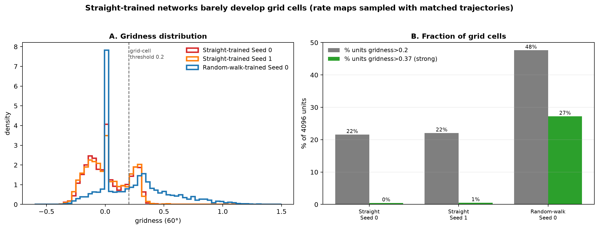
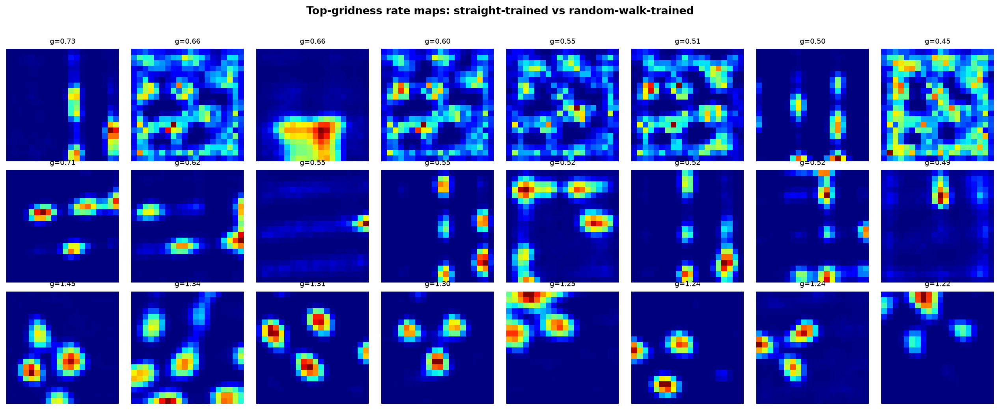

# Straight-path analyses: two distinct experiments

"Straight paths" show up in this project in **two very different experiments**, and they are easy to
conflate. This README covers both and makes the distinction explicit.

| | Experiment A | Experiment B |
|---|---|---|
| **What is straight** | the *evaluation* trajectory | the *training* trajectory |
| **The networks** | the existing random-walk-**trained** nets (10 seeds) | nets **trained** on straight paths (2 seeds, from Drive) |
| **Do they have grids?** | yes (grids formed during random-walk training) | **no** (grids never form) |
| **Question** | is the PGC "freeze" an artifact of random-walk *input*? | does the PGC experiment even transfer to straight-*trained* nets? |
| **Answer** | freeze persists (p=0.004) | experiment is ill-posed — no grids/PGCs to ablate |

The one-line reason they differ: a network that already grew a grid code keeps it no matter what path
you walk it on; but a network *trained* only on straight motion never grows a grid code in the first
place.

---

# Experiment A — Force the random-walk-trained networks to walk straight

**Motivation.** The "freeze" result (ablating predictive grid cells makes the grid population activity
stop changing over time) was measured on random-walk trajectories. Is it a property of the network's
dynamics, or an artifact of the unpredictable random-walk *input*? Test: change **only** the evaluation
trajectory to straight lines, on the **same** networks, and re-run the identical analysis.

**How "straight" is forced (methodology).** The trajectory generator normally adds a random turn to the
heading each step. In straight mode that turn is set to zero, so the heading stays **fixed** (the animal
walks in a straight line), with wall-avoidance as the only exception. Crucially, the random-number draws
are left **identical** to the random walk — same start position, same initial heading, same per-step
speeds — so the same seed produces the same journey **minus the turning**. This makes trajectory type
the *only* changed variable.
- **Verified straight:** wall-free straight paths have **0.00°** heading deviation (perfectly straight);
  random-walk paths deviate ~50°.
- **Boundary filter (secondary run):** ~47% of straight paths hit a wall and bend, so everything was
  also recomputed on the subset that never touches the wall (perfectly straight paths).
- **Everything else identical:** same networks, same predictive-cell definition, same 10 seeds, same
  conditions, same count-matched random sampling, same lags; the statistics functions are *imported*
  from the random-walk script (provably identical).

**Measure.** Grid population-vector autocorrelation `cos(g_t, g_{t+τ})` vs lag τ, on each condition's
surviving grid units (so zeroed units can't fake "frozen"). Headline: autocorrelation at a 20-step lag
(higher = more static/frozen).

**Result — the freeze persists and strengthens.** Autocorrelation@20 (mean over 10 seeds):

| eval trajectory | Intact | Predictive-ablated | Random (N) | Structural (N) |
|---|---|---|---|---|
| Random-walk | 0.52 | **0.65** | 0.54 | 0.56 |
| Straight (all) | 0.51 | **0.73** | 0.65 | 0.77 |
| Straight (no wall) | 0.44 | **0.74** | 0.67 | 0.83 |

- Predictive-ablated stays the most static vs the count-matched **random** ablation — **9/10 seeds,
  p=0.004** on random-walk *and* straight *and* boundary-free straight. The effect *strengthens* on
  straight paths (predictive 0.65 → 0.73–0.74). So the freeze is a property of the **recurrent
  dynamics**, not of the random-walk input statistics.
- **Honest nuance:** the predictive-vs-*structural* distinction seen on random walks **flips** on
  straight paths — structural-grid ablation freezes even more than predictive (struct 0.77–0.83 vs
  pred 0.73–0.74). Interpretation: on a straight path the "predict-the-next-state" demand is trivial, so
  the functional gap between predictive and structural grid cells collapses. The robust,
  trajectory-independent claim is **predictive vs random (p=0.004)**.
- *Verified by a 4-agent adversarial check: stats reproduce exactly, the controlled comparison is clean
  (only the eval trajectory changed), and the straight generation + boundary filter are provably correct.*

*Figures:* `population_activity_change_rw_vs_straight.png` (side-by-side), plus standalone
`population_activity_change_straight.png` and `..._straight_noboundary.png`.
*Scripts:* `code/aarav_population_activity_change_straight.py`, `code/aarav_population_change_straight_figure.py`.

---

# Experiment B — Networks *trained* on straight paths

**Motivation.** The deeper version: use networks that were *trained* on straight trajectories (from the
Drive) and run the PGC experiment there. To avoid confound, we must define predictive cells *within
these networks* — which first requires that they **have** grid cells at all.

**Gate check (methodology).** Before any ablation, ask: do straight-trained nets develop grid cells?
- **Rate maps:** run the network on many trajectories and, for each unit, bin its activity by the true
  position → a 2-D image of that unit's firing across the arena. A grid cell's rate map is a triangular
  lattice of bumps.
- **Fair sampling:** a straight-trained net was trained to integrate *straight* motion, so we sampled its
  rate maps with **matched straight trajectories** (many straight lines from random starts/directions —
  covers the box while letting the net integrate the motion it knows). Random-walk sampling gave the
  same answer, ruling out a sampling artifact.
- **Gridness score:** for each unit, take the rate map's spatial autocorrelogram and measure its
  **hexagonality** (60° vs 30°/90° rotational symmetry). Clean hexagonal grids score high; stripes,
  borders, and noise score low. Computed for all 4096 units, compared to a random-walk-trained net.

**Result — they barely develop grids (they use band cells).**

| network | mean gridness | strong grids (>0.37) | top cells look like |
|---|---|---|---|
| Straight-trained Seed 0 | 0.016 | 18 | stripes / borders / noise |
| Straight-trained Seed 1 | 0.016 | 21 | stripes / borders / noise |
| Random-walk-trained Seed 0 | 0.228 | 1115 | clean hexagonal lattices |

- Straight-trained nets have ~20 strongly-gridded units vs ~1100 in a random-walk net — a ~50× gap.
  Their top-gridness cells are visibly **stripe / border / noisy** cells, not hexagons.
- **But they learned the task:** final path-integration decoding error ~6.7 cm (Seed 0), ~7.5 cm (Seed 1),
  essentially matching the random-walk net's 6.1 cm. So it is a genuine **band-cell** solution, not a
  broken network. (Expected: hexagonal grids emerge from integrating arbitrary 2-D exploration;
  near-1-D straight motion admits a simpler code.)

**Conclusion.** The PGC-freeze experiment is **ill-posed** on straight-trained nets — no grids → no
predictive grid cells → nothing to ablate, and no torus to "freeze". A mechanical ablation on grid-less
units would be uninterpretable, so it is deliberately not reported. This is the deepest
confound-avoidance: you **cannot** decouple "PGC ablation" from "random-walk training," because
predictive grid cells only exist in networks that develop grids.

**Caveats.**
- Only **2** straight-trained seeds exist in the Drive (not 10), so no 10-seed statistics regardless.
- The gate used **zero-shift** gridness; predictive grid cells peak at a spatial shift, so a best-shift
  check is the airtight version. It was computationally prohibitive (~15–30 min/net) and not completed,
  but the conclusion holds from rate-map morphology (a stripe/border cell is non-hexagonal at *any*
  shift, and shifting a grid cell *moves* its hexagon rather than *creating* one).
- The Drive's own `_straight` analysis (in the random-walk folder) is **Experiment A's** regime —
  straight *evaluation* of the random-walk-trained net, which keeps 1201 grid / 348 predictive cells —
  not an analysis of the straight-trained nets.

*Figures:* `aarav_straight_trained/straight_gridness_distribution.png`, `.../straight_grid_gatecheck.png`.
*Scripts:* `code/aarav_straight_grid_gatecheck.py`, `code/aarav_straight_grid_distribution.py`,
`code/aarav_straight_bestshift_*.py`. Models are gitignored (not in the repo).

---

## Bottom line
- **Straight evaluation** of grid-developing networks → the PGC freeze holds (p=0.004) and even
  sharpens: it is a real dynamical effect, not an input artifact.
- **Straight-trained** networks → never develop grids/PGCs (they path-integrate with band cells), so the
  PGC experiment cannot be posed there. The freeze is intrinsic to networks that grow a grid code, which
  requires random-walk-like 2-D training.
