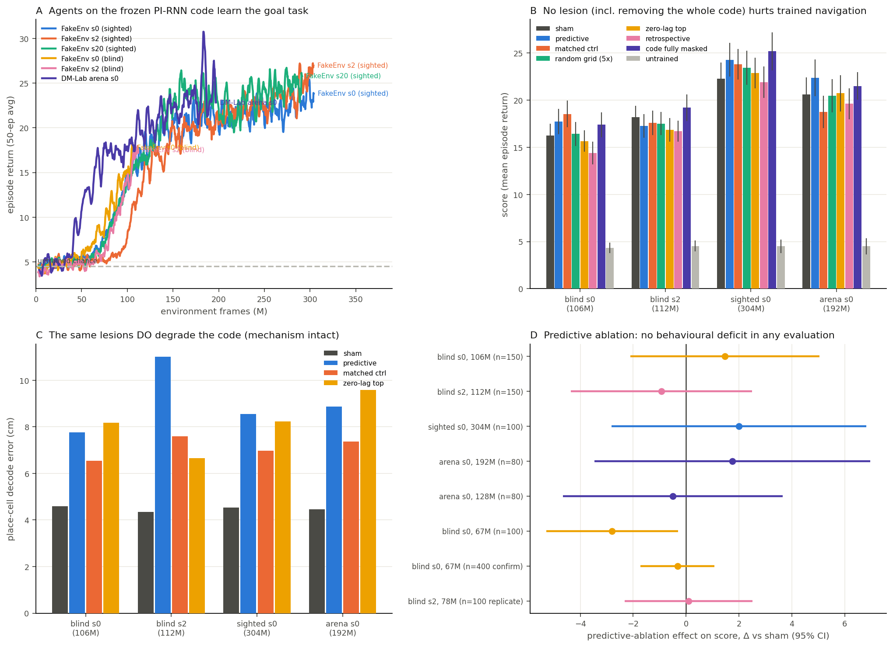

# RL navigation test of predictive grid cells — results (2026-08-15)

## Answer to the experimental question

**Ablating the identified predictive grid cells does not measurably damage
goal-directed navigation in this framework — in any environment, at any
training stage, against any control.** The single nominally significant hit
(blind s0 mid-competence, Δ = −2.80, p = 0.03 at n = 100) collapsed under
confirmation (Δ = −0.32 ± 0.71 SEM at n = 400, p = 0.65) and did not
replicate in the second seed (Δ = +0.10, p = 0.94). Across eight
evaluations the predictive-ablation 95% CIs all straddle zero (fig. D); the
n = 400 evaluation bounds any true effect to less than ~18% of sham score.

The reason is structural, and is itself a finding: **no lesion hurts these
agents — masking the policy's ENTIRE 4096-d spatial input leaves navigation
statistically intact** (e.g. blind s0 final: sham 16.3 ± 1.2 vs full mask
17.4 ± 1.3), even for agents whose vision carries no position information.
The policy LSTM, which receives previous action and reward as in the paper's
agent, constructs its own dead-reckoning; once policies mature, the external
path-integration code is redundant in these tasks. Grid-code input is not
rate-limiting for the behaviours tested.

**The mechanism-level result of the paper reproduces inside the RL loop:**
the same lesions that spare behaviour reliably degrade the code — predictive
ablation raises on-trajectory place-cell decode error from 4.6 to 6.4–11 cm
(fig. C), with the class-selectivity ordering (predictive/matched > zero-lag
at matched counts) intact. The dissociation is clean: the lesion damages the
representation, and the representation's damage does not reach behaviour
because behaviour does not depend on it here.

## What was run

Six agents trained (fixed A2C scaling, 8-action set, reward clip 1; see
banino commits c62392d and 2ec73a1): sighted FakeEnv × RNN seeds 0/2/20,
position-blind FakeEnv × seeds 0/2, DM-Lab square arena × seed 0, plus an
a3c no-code baseline (archived at 132M frames after matching the pirnn
curves — the first evidence the arena tasks are solvable code-free). All
ended 3–6× above the untrained-network chance line (fig. A).

Eight ablation evaluations (suite: sham, untrained chance, predictive,
retrospective, count-matched strongest zero-lag, property-matched control
via the pipeline's `select_matched_control`, 5× random grid-pool, 5×
random-any, readout-mode variants, full-code mask; 19–20 conditions each,
identical env seeds across conditions):

| evaluation | sham | predictive Δ (p) | matched Δ | full-mask Δ |
|---|---|---|---|---|
| blind s0, 106M, n=150 | 16.27 ± 1.23 | +1.47 (0.42) | +2.27 | +1.13 |
| blind s2, 112M, n=150 | 18.20 ± 1.20 | −0.93 (0.59) | −0.60 | +1.00 |
| sighted s0, 304M, n=100 | 22.30 ± 1.71 | +2.00 (0.42) | +1.50 | +2.90 |
| arena s0, 192M, n=80 | 20.62 ± 1.81 | +1.75 (0.51) | −1.88 | +0.88 |
| arena s0, 128M, n=80 | 18.62 ± 1.56 | −0.50 (0.81) | −1.50 | −0.62 |
| blind s0, 67M, n=100 | 9.90 ± 1.00 | −2.80 (0.03) | −2.20 | −1.70 |
| **blind s0, 67M, n=400** | 9.22 ± 0.51 | **−0.32 (0.65)** | −1.15 | −0.80 |
| blind s2, 78M, n=100 | 7.60 ± 0.81 | +0.10 (0.94) | −0.30 | −0.70 |

Untrained chance: 4.3–5.0 everywhere (measured per protocol; an untrained
network is not a uniform-action policy). An early arena preview suggesting
34% full-mask reliance at 124M (26.7→17.7, n=30) did not survive the
rigorous protocol at the neighbouring checkpoint (n=80: −0.62, p=0.78) and
is recorded as unreplicated.

## Interpretation for the paper

1. This RL framework cannot currently provide behavioural evidence for (or
   against) predictive-cell function, because its policies do not depend on
   any external spatial code in the tasks where full train→lesion cycles
   are feasible in a day. The bound is the task ecology, not the lesion.
2. The negative is informative for the vector-navigation literature: with
   Mnih-scaled A2C and standard inputs (prev action/reward), agents in open
   arenas — even fully vision-blind ones — learn internal dead-reckoning
   that renders a high-quality external path-integration code (4.6 cm
   decode) behaviourally redundant. Claims that grid-like codes drive
   navigation performance need task ecologies that defeat internal
   integration; this likely contributes to why the reproduction of Banino
   et al.'s performance separations has been elusive (see banino REPORT.md:
   the published full-scale numbers sat on the untrained chance line before
   the 2026-08-15 loss-scaling fix).
3. The paper's decode-level ablation results transfer to the RL loop
   unchanged — the predictive-cell effect on the code is robust to the
   agent's behaviour distribution.

## Pending (running beyond today's window)

`pirnn-doors-s0` (`explore_obstructed_goals_small` — the paper's
headline-separation task; a random walker scores 0 goals in 1500 steps
there, vs ~0.8/episode in the arena) and `pirnn-goal-s0`
(`explore_goal_locations_small`), both detached containers with ~14 h to
budget. Decision rule: run the suite on a trained doors checkpoint; if the
full-code mask shows a real deficit there, the predictive-vs-matched
contrast becomes a live behavioural test in the paper's own ecology; if
not, the decisive follow-up is a policy variant with `prev_action`
withheld, so position information cannot be internally integrated.

## Reproducibility

- banino @ c62392d+: `rl/pi_rnn.py` (bit-exact stepwise port + lesion,
  verified by `rl/test_pi_rnn.py`), `rl/train_rl.py --agent pirnn`,
  `rl/eval_pirnn.py` (`--random_policy` chance line).
- This repo: `rl_navigation/run_ablation_suite.py` (unit sets from each
  seed's `pgc_rigor` outputs; property matching via the paper pipeline's
  own code), `launch_runs.sh`, `results/*.json` (all suite summaries +
  training metrics), `make_figures.py`.
